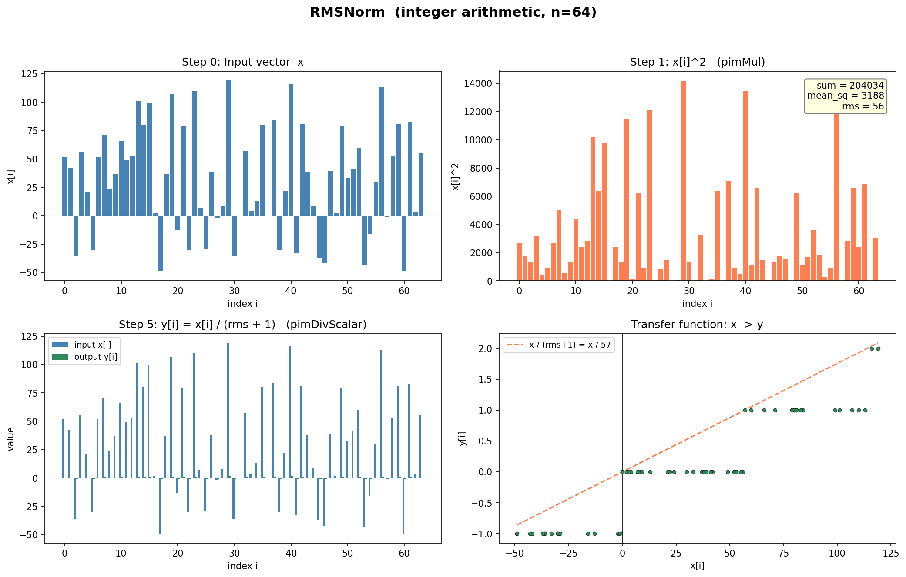
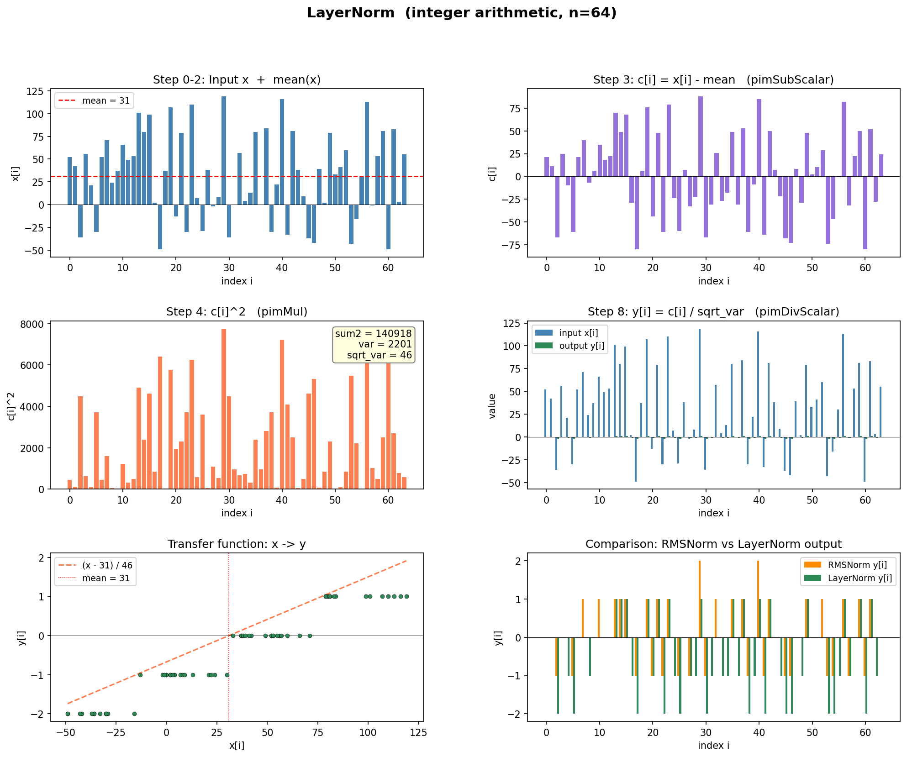

# PIM Kernels for RMSNorm and LayerNorm

## 1. Algorithm Descriptions

### 1.1 RMS Normalization (RMSNorm)

RMSNorm is a simplification of LayerNorm that skips mean-centering and normalizes
by the root mean square of the input vector. It is used in architectures like
LLaMA and T5 as a cheaper alternative to full layer normalization.

**Mathematical definition:**

```
y_i = (x_i / RMS(x)) * gamma_i

where  RMS(x) = sqrt( epsilon + (1/n) * sum_{i=1}^{n} x_i^2 )
```

For this assignment, gamma_i = 1 and epsilon = 1 (integer arithmetic).

**Algorithm steps (sequential):**

```
1. Square:    sq_i = x_i * x_i              for all i    -- O(n)
2. Reduce:    sum_sq = sum(sq_i)                          -- O(n)
3. Mean:      mean_sq = sum_sq / n                        -- O(1)
4. Sqrt:      rms = sqrt(mean_sq + 1)                     -- O(1)
5. Normalize: y_i = x_i / (rms + 1)         for all i    -- O(n)
```

Total work: O(n), with two data-parallel passes (steps 1, 5) and one reduction (step 2).
Steps 3-4 are scalar and data-dependent on the reduction result.

### 1.2 Layer Normalization (LayerNorm)

LayerNorm normalizes each input vector to zero mean and unit variance. It is the
standard normalization used in Transformers (BERT, GPT, etc.).

**Mathematical definition:**

```
y = ((x - E[x]) / sqrt(Var[x] + epsilon)) * gamma + beta

where  E[x]   = (1/n) * sum_{i=1}^{n} x_i
       Var[x] = (1/n) * sum_{i=1}^{n} (x_i - E[x])^2
```

For this assignment, gamma = 1, beta = 0, epsilon = 1 (integer arithmetic).

**Algorithm steps (sequential):**

```
1. Reduce:      sum = sum(x_i)                              -- O(n)
2. Mean:        mean = sum / n                               -- O(1)
3. Center:      c_i = x_i - mean                for all i   -- O(n)
4. Square:      sq_i = c_i * c_i                for all i   -- O(n)
5. Reduce:      sum2 = sum(sq_i)                             -- O(n)
6. Variance:    var = sum2 / n                               -- O(1)
7. Sqrt:        sqrt_var = sqrt(var + 1)                     -- O(1)
8. Normalize:   y_i = c_i / sqrt_var            for all i   -- O(n)
```

Total work: O(n), with three data-parallel passes (steps 3, 4, 8), two reductions
(steps 1, 5), and scalar host operations (steps 2, 6-7).

### 1.3 Comparison

| Property | RMSNorm | LayerNorm |
|----------|---------|-----------|
| Mean centering | No | Yes |
| PIM parallel ops | 2 (mul, divScalar) | 4 (subScalar, mul, divScalar, + extra redSum) |
| PIM reductions | 1 | 2 |
| CPU scalar ops | 1 division + 1 sqrt | 2 divisions + 1 sqrt |
| PIM objects needed | 2 (src, dst) | 3 (src, dst, tmp) |
| Data transfers | 1 H2D + 1 D2H | 1 H2D + 1 D2H |

---

## 2. PIM Parallelism Strategy

### 2.1 Bank-Level PIM Architecture

PIMeval simulates a bank-level PIM architecture where each DRAM bank contains a
processing element that can perform arithmetic on data stored locally. The key
properties:

- **Parallelism source**: Each bank operates independently and in parallel.
  With Rank 8 config: 8 ranks x 128 banks/rank = 1024 PIM cores.
- **Data distribution**: `pimAlloc(PIM_ALLOC_AUTO, n, PIM_INT32)` stripes the
  vector across all available banks. Element `i` is placed in bank `i % num_banks`.
- **SIMD within bank**: Each bank processes its local slice of the vector through
  its columns (8192 columns wide).

### 2.2 What Runs on PIM vs CPU

The fundamental constraint: PIM can execute **element-wise** and **reduction**
operations in parallel across all banks, but **data-dependent scalar arithmetic**
(division by n, square root) must return to the CPU host.

```
PIM (parallel across all banks)        CPU (scalar, sequential)
====================================   ========================
pimMul:       O(n/num_banks)            integer division: O(1)
pimRedSum:    O(n/num_banks + log(B))   newton_sqrt:      O(log(val))
pimSubScalar: O(n/num_banks)
pimDivScalar: O(n/num_banks)
```

The `pimRedSum` operation first reduces locally within each bank (parallel), then
aggregates across banks (sequential tree reduction over B banks). The final scalar
result is written to host memory.

### 2.3 How Parallelism Scales with Rank Count

More ranks = more banks = more PIM cores = finer data partitioning:

| Config | Ranks | Total Banks | PIM Cores | Elements per Core (n=16384) |
|--------|-------|-------------|-----------|----------------------------|
| Rank 1 | 1 | 128 | 128 | 128 |
| Rank 4 | 4 | 512 | 512 | 32 |
| Rank 8 | 8 | 1024 | 1024 | 16 |
| Rank 16 | 16 | 2048 | 2048 | 8 |
| Rank 32 | 32 | 4096 | 4096 | 4 |

For small vectors (n=128), many cores are idle — the vector cannot fill all banks.
For larger vectors, the work distributes more evenly, and more ranks yield better
speedup.

### 2.4 Memory Allocation Strategy

`pimAllocAssociated(srcObj, PIM_INT32)` ensures that the associated object is
placed in the **same banks** as `srcObj`. This is critical: element-wise operations
like `pimMul(A, B, C)` require A[i], B[i], and C[i] to be co-located in the same
bank. Without associated allocation, data would need to be shuffled between banks,
negating the parallelism benefit.

For RMSNorm: `dstObj` is associated with `srcObj1` (2 co-located vectors).
For LayerNorm: both `dstObj` and `tmpObj` are associated with `srcObj1` (3 co-located vectors).

---

## 3. PIM API Operations Used

| Operation | API Call | Semantics | Parallelism |
|-----------|----------|-----------|-------------|
| Element-wise multiply | `pimMul(src1, src2, dest)` | `dest[i] = src1[i] * src2[i]` | All banks in parallel |
| Reduction sum | `pimRedSum(src, &sum)` | `sum = sum(src[i])` | Local reduce + cross-bank aggregate |
| Scalar subtract | `pimSubScalar(src, dest, scalar)` | `dest[i] = src[i] - scalar` | All banks in parallel |
| Scalar divide | `pimDivScalar(src, dest, scalar)` | `dest[i] = src[i] / scalar` | All banks in parallel |

---

## 4. Implementation Details

### 4.1 RMSNorm (`rmsnorm/PIM/rmsnorm.cpp`)

File: `rmsnorm/PIM/rmsnorm.cpp`

The skeleton provides allocation (`srcObj1`, `dstObj`) and host-to-device copy.
We fill in 4 PIM operations:

```
Step  Where   API Call                                    What it does
----  ------  ------------------------------------------  ----------------------------------
 1    PIM     pimMul(srcObj1, srcObj1, dstObj)             dstObj[i] = x_i * x_i
 2    PIM     pimRedSum(dstObj, &sum)                      sum = sum(x_i^2)  -> host
 3    CPU     mean_sq = sum/n; rms = newton_sqrt(mean+1)   scalar arithmetic (timed)
 4    PIM     pimDivScalar(srcObj1, dstObj, rms+1)         dstObj[i] = x_i / (rms+1)
```

**Execution timeline** (arrows show data dependencies):

```
     PIM banks (parallel)                  Host CPU
     ────────────────────                  ────────
 1.  pimMul  ───────────────┐
                             │ (all banks compute x_i^2 in parallel)
 2.  pimRedSum ─────────────┼──> sum lands on host
                             │              │
                             │         3. mean_sq = sum/n
                             │            rms = sqrt(mean_sq+1)
                             │              │
 4.  pimDivScalar <─────────┘──────────────┘ (rms+1 broadcast to all banks)
     (all banks compute x_i/(rms+1) in parallel)
```

**Data flow across PIM objects:**

```
srcObj1:  [x_0, x_1, ..., x_n]     (input — preserved, reused in step 4)
dstObj:   [x_0^2, x_1^2, ...]      (after step 1, consumed by step 2)
       -> sum_sq                     (reduction result on host)
dstObj:   [x_0/(rms+1), ...]        (after step 4 — final output, copied to host)
```

Note: `srcObj1` is read but not written by `pimMul` (src and dest are different),
so the original input is still available for the final `pimDivScalar`.

---

### 4.2 LayerNorm (`lnorm/PIM/lnorm.cpp`)

File: `lnorm/PIM/lnorm.cpp`

We handle allocation, copies, and all PIM operations. Three PIM objects needed:
- `srcObj1`: input vector x (read-only after initial copy)
- `tmpObj`: stores (x - mean), preserved for the final normalization
- `dstObj`: scratch for squared diffs, then final output

```
Step  Where   API Call                                      What it does
----  ------  --------------------------------------------  ----------------------------------
 0    --      pimAlloc + 2x pimAllocAssociated              allocate src, dst, tmp (co-located)
 1    H->D    pimCopyHostToDevice(srcVector, srcObj1)        copy input to PIM
 2    PIM     pimRedSum(srcObj1, &sum)                       sum = sum(x_i)  -> host
 3    CPU     mean = sum / n                                 scalar division (timed)
 4    PIM     pimSubScalar(srcObj1, tmpObj, mean)            tmpObj[i] = x_i - mean
 5    PIM     pimMul(tmpObj, tmpObj, dstObj)                 dstObj[i] = (x_i - mean)^2
 6    PIM     pimRedSum(dstObj, &sum2)                       sum2 = sum((x_i-mean)^2) -> host
 7    CPU     var = sum2/n; sqrt_var = sqrt(var+1)           scalar arithmetic (timed)
 8    PIM     pimDivScalar(tmpObj, dstObj, sqrt_var)         dstObj[i] = (x_i-mean) / sqrt_var
 9    D->H    pimCopyDeviceToHost(dstObj, dst)               copy result to host
10    --      pimFree(srcObj1, dstObj, tmpObj)                deallocate
```

**Execution timeline:**

```
     PIM banks (parallel)                  Host CPU
     ────────────────────                  ────────
 2.  pimRedSum(src) ────────────────> sum lands on host
                                           │
                                      3. mean = sum / n
                                           │
 4.  pimSubScalar(src, tmp, mean) <────────┘ (mean broadcast to all banks)
     (all banks compute x_i - mean)
                    │
 5.  pimMul(tmp, tmp, dst)
     (all banks compute (x_i-mean)^2)
                    │
 6.  pimRedSum(dst) ────────────────> sum2 lands on host
                                           │
                                      7. var = sum2 / n
                                         sqrt_var = sqrt(var+1)
                                           │
 8.  pimDivScalar(tmp, dst, sqrt_var) <────┘ (sqrt_var broadcast to all banks)
     (all banks compute (x_i-mean)/sqrt_var)
```

**Data flow across PIM objects:**

```
srcObj1:  [x_0, x_1, ..., x_n]          (input — read-only after step 1)
       -> sum = pimRedSum(srcObj1)        (step 2)
       -> CPU: mean = sum / n             (step 3)
tmpObj:   [x_0-mean, x_1-mean, ...]      (step 4 — preserved for step 8)
dstObj:   [(x_0-mean)^2, ...]            (step 5, consumed by step 6)
       -> sum2 = pimRedSum(dstObj)        (step 6)
       -> CPU: variance, sqrt_var         (step 7)
dstObj:   [(x_0-mean)/sqrt_var, ...]     (step 8 — final output, copied to host)
```

Key design choice: `tmpObj` holds the centered vector (x - mean) and is **not
overwritten** by subsequent operations. This avoids recomputing it: steps 5-6 use
`dstObj` as scratch, so `tmpObj` is still available for the final division in step 8.

---

## 5. PIM vs CPU: Where the Speedup Comes From

On a conventional CPU, each normalization step executes sequentially over all n
elements. On PIM:

- **Element-wise ops** (`pimMul`, `pimSubScalar`, `pimDivScalar`) execute across
  all B banks in parallel, reducing O(n) work to O(n/B) time per bank.
- **Reductions** (`pimRedSum`) reduce locally in each bank (O(n/B)), then aggregate
  across banks (O(B)). For large n, this is much faster than a serial loop.
- **Scalar ops** (mean, sqrt) are identical on both — but they're O(1), so they
  don't dominate.
- **Data movement** (host-to-device, device-to-host) is overhead that PIM pays
  but CPU does not. For small vectors, this overhead can negate the parallel gains.

Expected scaling behavior:
- **Small n (128)**: Few elements per bank, data transfer overhead dominates. PIM
  may not outperform CPU.
- **Large n (8192, 16384)**: Banks are well-utilized, parallel compute dominates.
  More ranks = more banks = better speedup.

---

## 6. Integer Arithmetic Notes

Both kernels use `int32_t` (PIM_INT32) rather than floating point:
- Squaring can overflow for large input values. The `getVector` utility generates
  values as `i % MAX_NUMBER` which keeps magnitudes bounded.
- Division is integer truncation (floor toward zero).
- Square root uses Newton-Raphson iteration (`newton_sqrt`) which converges to the
  integer floor of the true square root.
- Epsilon = 1 (added before sqrt) prevents division by zero when the vector is
  all-zeros. For RMSNorm, an additional +1 is added to the divisor (`rms + 1`).

---

## 7. Verification

Both kernels verified with `-v t` at all required vector lengths:

```bash
./rmsnorm.out -l 128 -v t     # Correct Answer!!
./rmsnorm.out -l 4096 -v t    # Correct Answer!!
./rmsnorm.out -l 8192 -v t    # Correct Answer!!
./rmsnorm.out -l 16384 -v t   # Correct Answer!!

./lnorm.out -l 128 -v t       # Correct Answer!!
./lnorm.out -l 4096 -v t      # Correct Answer!!
./lnorm.out -l 8192 -v t      # Correct Answer!!
./lnorm.out -l 16384 -v t     # Correct Answer!!
```

Verification compares PIM output element-by-element against the CPU reference
implementation in `main()`. Both must produce identical integer results.

---

## 8. Visualizations

### RMSNorm Step-by-Step



### LayerNorm Step-by-Step



---

## 9. Files

- `rmsnorm/PIM/rmsnorm.cpp` — RMSNorm PIM kernel (4 PIM operations)
- `lnorm/PIM/lnorm.cpp` — LayerNorm PIM kernel (6 PIM operations + alloc/copy/free)
- `rmsnorm/baselines/CPU/rmsnorm.cpp` — CPU reference implementation
- `lnorm/baselines/CPU/lnorm.cpp` — CPU reference implementation
- `scripts/run_norm_eval.sh` — evaluation script (sweeps configs x vector lengths)
